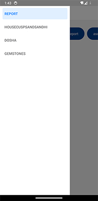
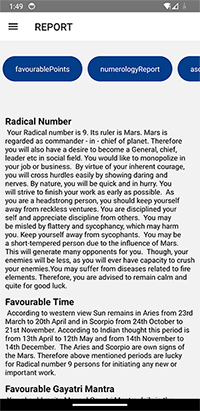

# Assignment Completed

## Assignment Description:

Create a user interface featuring tabs, each tab displaying corresponding details. The provided sample data consists of an object wherein the keys represent the tabs. If a key's value is another object, nested tabs should be generated using the child object's keys. When a key's value is an array, interpret it as the detail content of the tab.

### Detail Content Types:

#### Type 1: KEY-VALUE
A plain object is provided in the "data" field.
Generate a table with two columns: "Key" and "Value". 
 #### Type 2: PARAGRAPH
An array of strings or a single string is given in the "data" field.
Display the strings as provided. 
#### Type 3: KEY_PARAGRAPH
An object is provided in the "data" field where each key represents a heading and its corresponding string value represents a paragraph. 
#### Type 4: TABLE
An array of objects is provided.
Generate a table where the keys of each element object represent the table headings, and their values populate the rows of the table.

# Screenshots
(i) Create a user interface featuring tabs, each tab displaying corresponding details.  

(ii.) Type 2: PARAGRAPH
An array of strings or a single string is given in the "data" field.
Display the strings as provided.

